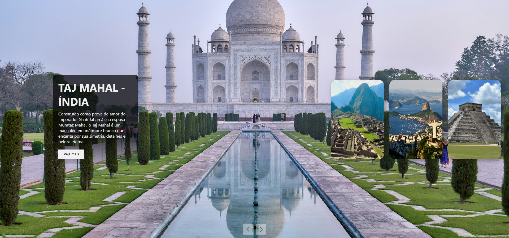

# 🌍 The 7 Wonders of the Modern World - Interactive Gallery

This project is an interactive web application that visually showcases the **Seven Wonders of the Modern World**, combining HTML, CSS, and JavaScript to provide an elegant carousel-style experience. Each wonder includes a short description and a dedicated article page.

## 📸 Preview



## 🚀 Features

- 🎢 Carousel with navigation buttons
- ✨ Smooth animations using CSS transitions
- 🎨 Dynamic background images for each wonder
- 📱 Responsive layout (desktop-optimized)
- 📄 Dedicated pages with more information for each wonder

## 🧱 Technologies Used

- HTML5
- CSS3
- JavaScript (Vanilla)
- Font Awesome (for icons)

## 📂 Project Structure

```
.
├── assets
│   ├── styles
│   │   ├── index.css          # Main carousel styles
│   │   └── artigos.css        # Article page styles
│   └── images                 # Background images for each wonder
├── articles                   # Individual HTML pages for each wonder
│   ├── coliseu.html
│   ├── taj-mahal.html
│   └── ...                    # etc.
├── javascript
│   └── script.js              # Carousel logic
└──index.html                 # Homepage
```

## 🧠 How It Works

- Items are positioned using `nth-child()` and CSS transitions.
- The central item is highlighted, with content and buttons displayed.
- Left and right navigation buttons allow carousel rotation.
- Clicking on the central card leads to a detailed article page.
- The header changes color when scrolling, enhancing navigation awareness.

## 🏛 Wonders Featured

1. Coliseum - Italy
2. Taj Mahal - India
3. Machu Picchu - Peru
4. Christ the Redeemer - Brazil
5. Chichén Itzá - Mexico
6. Petra - Jordan
7. Great Wall of China - China

## 📥 How to Use

1. Clone this repository:
```bash
git clone https://github.com/your-username/seven-wonders-carousel.git
```

2. Open `index.html` in your browser.

> ✅ No server required. All files run client-side.

## 💡 Future Improvements

- Add responsive support for mobile
- Include light/dark mode toggle
- Enhance accessibility

## 📝 License

This project is open-source and free to use under the [MIT License](LICENSE).

---
Built with ❤️ by Gustavo Ávila
